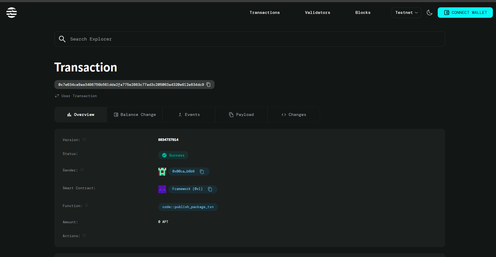

# Dice Game Contract

## Project Description
The Dice Game Contract is a provably fair blockchain-based gambling application built on the Aptos blockchain. Players can place bets on dice rolls with transparent, verifiable outcomes while the house maintains a configurable edge to ensure sustainability. The contract implements a simple high/low betting system where players wager on whether a dice roll (1-6) will be high (4-6) or low (1-3).

## Project Vision

Our vision is to revolutionize online gambling by providing a completely transparent, decentralized dice game that eliminates trust issues inherent in traditional online casinos. By leveraging blockchain technology, we ensure that every game outcome is verifiable, every transaction is transparent, and the house edge is clearly defined and immutable. We aim to create a fair gaming ecosystem where players can enjoy gambling with complete confidence in the integrity of the system.

## Key Features

- **Provably Fair Gaming**: All dice rolls are generated using blockchain-verifiable pseudo-random algorithms
- **Transparent House Edge**: Configurable and clearly visible house edge percentage (maximum 10%)
- **Simple Betting Mechanism**: Easy-to-understand high/low betting system
- **Automatic Payouts**: Instant, automated payouts for winning bets
- **Game Statistics**: Complete tracking of player statistics and game history
- **Decentralized Operation**: No central authority can manipulate game outcomes
- **Low Transaction Costs**: Efficient smart contract design minimizes gas fees
- **Secure Fund Management**: Built-in safety mechanisms for handling player funds

## Future Scope

- **Multiple Betting Options**: Expand beyond high/low to include specific number betting
- **Progressive Jackpots**: Implement accumulating jackpot system for special combinations
- **Multi-Token Support**: Accept various cryptocurrencies beyond AptosCoin
- **Tournament Mode**: Organize competitive dice rolling tournaments
- **Social Features**: Add leaderboards, achievements, and social gaming elements
- **Mobile dApp**: Develop native mobile applications for iOS and Android
- **Advanced Analytics**: Provide detailed statistical analysis for players
- **Referral System**: Implement player referral and reward mechanisms
- **VIP Tiers**: Create loyalty programs with increasing benefits
- **Cross-Chain Integration**: Expand to multiple blockchain networks

## Contract Details

*[Content to be written by project maintainer]*

